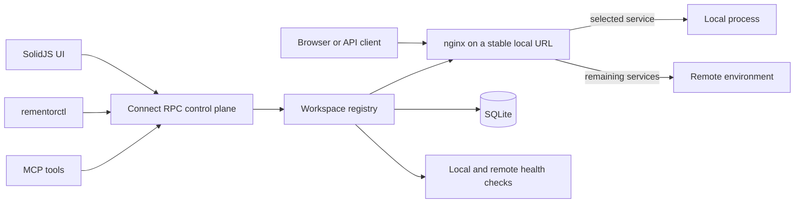

# Rementor

**A local control plane for developing one microservice against the rest of a
remote stack.**

Rementor lets a developer run only the service they are changing, route selected
traffic to it, and leave every other dependency on a shared environment. A web
UI, CLI, and MCP server all use the same typed control-plane API.


- Switch individual paths or hostnames between local ports and remote upstreams.
- Compare local and remote health without starting the full service graph.
- Generate and validate nginx routes from persisted workspace configuration.
- Control routing from a SolidJS UI, `rementorctl`, or coding-agent MCP tools.
- Keep the workflow reproducible with SQLite state, Protocol Buffers, and a
  rootless mock demo.

## Why It Exists

In a large microservice system, running the entire stack locally is often slow or
impossible. A typical feature needs one local service plus authentication,
frontends, APIs, and data services that already exist in a shared environment.

Rementor provides a stable local URL while choosing, per application, whether
requests go to local code or a remote baseline. This shortens the feedback loop
for feature work and makes distributed routing failures visible.

## Try It

The demo contains only neutral mock services and loopback addresses. It does not
need credentials, private DNS, or access to a real environment.

Prerequisites: Docker with Compose.

```bash
docker compose up --build
```

Open <http://localhost:8080>. The demo starts:

| Component | Address |
|---|---|
| Rementor UI and reverse proxy | `http://localhost:8080` |
| Remote mock stack | internal `127.0.0.1:18080` |
| Local mock services | internal `127.0.0.1:28080-28082` |

The `demo` workspace is registered automatically. Toggle `orders-api` in the UI,
then compare the routed response in a browser:

```text
http://api.localhost:8080/orders
```

Or use curl against the published localhost port with an explicit Host header:

```bash
curl -H 'Host: api.localhost' http://localhost:8080/orders
```

The demo applications are `web`, `orders-api`, and `billing-api`. The canonical
paths to compare are `/` for `web`, `/orders`, and `/billing`.

Without Docker Compose, the same image can be run directly:

```bash
docker build -t rementor-demo .
docker run --rm -p 127.0.0.1:8080:8080 rementor-demo
```

The demo port is bound to loopback by default. To intentionally expose it on
another interface, pass the bind host explicitly:

```bash
REMENTOR_DEMO_HOST=0.0.0.0 docker compose up --build
docker run --rm -p 0.0.0.0:8080:8080 rementor-demo
```

The same `build` and `run` commands also work with Podman.

Only expose the demo on trusted networks. The control plane is designed for
local development, not as a remotely authenticated service.

## Workflow



1. Define a workspace for a remote environment.
2. Register applications with their route, context, local port, and health path.
3. Start one application locally.
4. Toggle that application to local; all other routes remain remote.
5. Toggle it back to compare behavior against the remote baseline.

Routing changes are applied before state is persisted. If nginx validation or
reload fails, Rementor restores the previous in-memory and persisted state.

## CLI Example

Start the server and frontend for development:

```bash
make setup
make dev
```

For an installed user service, open the Rementor UI at
<http://rementor.localhost/> through nginx. If nginx has not been reloaded yet,
use the direct fallback <http://localhost:9300>. Generated nginx routes also
listen on loopback port `80`, so configured local domains such as
`http://api.localhost/` do not require a port. The Docker demo remains on
`8080` because it runs nginx without root privileges.

In another terminal:

```bash
go run ./examples/mock-stack
make build-ctl

./dist/rementorctl workspace create demo \
  --name "Demo Workspace" \
  --local-domain api.localhost \
  --default-remote-base-url http://127.0.0.1:18080

./dist/rementorctl app register demo orders-api \
  --name "Orders API" \
  --port 28081 \
  --path /orders \
  --context /orders \
  --health health

./dist/rementorctl app toggle demo orders-api
./dist/rementorctl --json app list demo

# Inspect, plan, apply, and verify normalized routes.
./dist/rementorctl route get demo
./dist/rementorctl route conflicts --workspace demo
./dist/rementorctl route resolve demo --host api.localhost --path /orders/42
./dist/rementorctl route plan demo orders-api --mode local
./dist/rementorctl route apply demo orders-api --mode local --idempotency-key orders-local
./dist/rementorctl route sync demo

# Resolve the stable browser entry point (aliases are accepted).
./dist/rementorctl url --workspace demo --app orders-api
```

Flags may appear before or after positional arguments.

## Architecture

| Area | Implementation |
|---|---|
| Control plane | Go, Echo, Connect RPC |
| API contract | Protocol Buffers, Buf, generated Go and TypeScript clients |
| Frontend | SolidJS, TypeScript, Vite, Tailwind CSS |
| Persistence | SQLite under XDG data directories |
| Routing | Validated nginx configuration with atomic replacement and rollback |
| Automation | CLI plus MCP tools backed by the generated Connect client |
| Observability | Local/remote health checks and per-client streaming updates |

SQLite stores durable workspace configuration and route state. The daemon keeps
an in-memory runtime projection for low-latency routing operations, health
checks, connected UI streams, and routing-provider state. Mutations build and
validate a detached candidate, apply nginx routing from it, persist the durable
state, then publish it to the runtime projection. A persistence failure triggers
a compensating nginx reload from the previous snapshot.

Key directories:

```text
proto/rementor/v1/       Protocol Buffers API contract
internal/rpc/            Connect RPC service and CSRF guard
internal/services/       Registry, health checks, and routing transactions
internal/nginx/          nginx renderer, validation, and atomic reload
internal/config/         SQLite persistence and migrations
internal/cli/            CLI and MCP control surfaces
web/frontend/            SolidJS application and generated TypeScript client
examples/mock-stack/     Sanitized local/remote service simulation
examples/docker/         Rootless nginx demo runtime
```

## nginx Integration

Rementor runs without nginx for the UI, CLI, MCP, configuration, and health
features. On a host with nginx installed, `make install` creates a private,
unprivileged nginx instance on `127.0.0.1:18080`. Point an existing system
reverse proxy at that upstream to expose Rementor's local domains on port 80.

For manually managed nginx instances, the `http` block must include:

```nginx
include /home/you/.config/rementor/nginx/*.conf;
```

Rementor writes generated routes to that XDG directory and verifies with
`nginx -T` that the generated file is part of the effective configuration
before reloading. It does not edit `/etc/nginx/nginx.conf`, install sudoers
rules, modify `/etc/hosts`, or configure DNS.

Every generated proxy location adds `X-Rementor-*` response proof headers for
the canonical app/service, workspace and environment, effective mode (`local`,
`remote`, or `fallback`), route version, operation ID, and a validated
correlation/request ID. Upstream copies of those headers are hidden before the
Rementor values are added, and the proof headers are exposed to local browser
origins through CORS. Send `X-Correlation-ID` or `X-Request-ID` to preserve a
safe correlation value; otherwise nginx generates one. The
`/__rementor/trace` path returns a small request-inspection payload through the
control plane for debugging stale proxy projections.

The container demo and the user-owned host nginx follow the same privilege
boundary. Do not make a privileged nginx master load files from a directory
writable by untrusted users.

## Security Model

- The unauthenticated control plane binds to loopback only; non-loopback bind
  addresses are rejected.
- The container demo publishes its port to `127.0.0.1` by default. Exposing it
  on another interface is an explicit opt-in for trusted networks.
- Browser mutations require a process-scoped CSRF token.
- Generated routes add CORS headers only for local development origins such as
  `localhost`, `127.0.0.1`, `::1`, and `*.localhost`.
- Workspace, URL, hostname, path, and route-pattern input is validated before
  persistence or nginx rendering.
- Remote URLs containing embedded credentials are rejected.
- The demo container runs as an unprivileged user.

See [SECURITY.md](SECURITY.md) for operational guidance and reporting.

## Development

### Canonical application identities

Each registered application has a stable `appId` and `serviceId`. The legacy
`id` field remains an alias for `appId`, so existing workspace files continue to
load unchanged. A single identity can be bound in multiple environments while
keeping environment-specific route metadata separate:

```text
appId: rtc
serviceId: reforma-tributaria-consumo
aliases: [reforma-tributaria-consumo, front-giss-v2]
workspace: desenvolvimento  -> /rtc
workspace: qualidade        -> /rtc
```

Aliases are normalized (case, whitespace, and separators), and collisions are
rejected instead of selecting an arbitrary application. Resolve or register an
alias with the CLI:

```bash
rementorctl app resolve desenvolvimento front-giss-v2
rementorctl app alias desenvolvimento rtc front-giss-v2
```

### Shared routing contract

The generated protobuf contract is the source of truth for RPC, CLI, MCP, and
the browser. Responses include an explicit `identity` reference, an
`environment` reference, and a typed `route` projection alongside the legacy
`id`, `active`, and timestamp-string fields. Route-affecting mutations return
`operationId`, `routeVersion`, typed creation/completion timestamps, and a
`correlationId`; callers may supply a correlation ID in the request or let
Rementor generate one.

Browser URLs are resolved from the canonical application identity and the
selected workspace/environment public binding. `rementorctl url` and the MCP
`rementor_url` tool return the stable URL separately from the current local or
remote proxy target, together with route version, effective mode, and the last
operation/correlation metadata. Switching an application between local and
remote therefore never changes the URL a browser should open.

Existing workspace files and RPC clients remain compatible: `id` is treated as
the legacy alias for `appId`, `workspaceId` remains the environment key, and
the old boolean/string fields are retained while clients migrate to the typed
messages. RPC failures keep their Connect status and human-readable message,
and carry a `StructuredError` detail with a stable machine-readable code.

### Route metadata and frontend roots

Route registration now separates the browser-facing `publicPath` from the
upstream service `upstreamContext`. `frontendRoot` can be supplied by
registration metadata or a repository manifest when the frontend build base is
known. Paths are canonicalized (including trailing slashes) before routing;
malformed paths and contradictory legacy/new values are rejected before nginx
or SQLite are touched.

For explicit metadata, nginx rewrites the public prefix to the upstream
context while preserving the request suffix. Legacy path/context-only records
retain their historical context-as-ingress behavior until they are explicitly
migrated.

The legacy `path` and `context` fields are read as aliases during migration and
are written alongside the explicit fields so older clients continue to work.
When only legacy metadata is supplied, Rementor preserves its historical
context-as-ingress behavior while exposing a migration warning. A nested public
path without a proven frontend root produces a structured warning with a
stable code, field, severity, and remediation. Pass `--strict-metadata` to
`app register`, `route plan`, or `route apply` (or set the corresponding RPC
flag) to promote selected warnings to validation errors.


Prerequisites:

- Go 1.25
- Node.js 22
- Buf
- `protoc-gen-go`
- `protoc-gen-connect-go`

```bash
make setup
make generate
make build
```

Run the same quality gates used in CI:

```bash
buf lint
make generate
git diff --exit-code
cd web/frontend
npm ci
npm audit
npm run typecheck
npm run build
cd ../..
go vet ./...
go test -race ./...
```

Generated RPC clients are committed. The frontend bundle is generated into
`cmd/server/dist/` and ignored by Git; run `make frontend` before starting the
server or running Go checks.

## Scope

Rementor is a Linux-oriented local development tool, not a production gateway.
It currently compares routing state and local/remote health; request/response
payload diffing is not implemented.

## License

[MIT](LICENSE)
